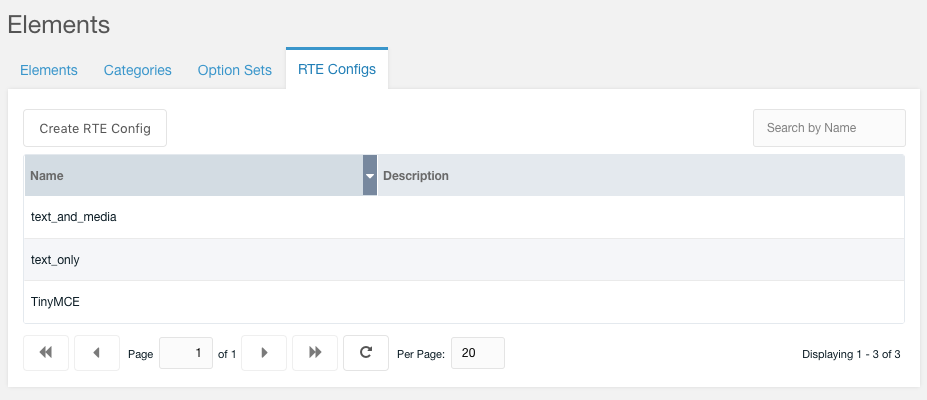

# Rich Text Editor (RTE) Configurations

Under the RTE Configs tab you can manage all configuration sets for any installed RTEs.
 

RTE configs must have a unique name, which is used in [data-fred-rte-config](/elements/attributes/#data-fred-rte-config) attribute to determin which RTE to use, if any.

Make sure RTE configs are valid JSON; you can use [JSON Lint](https://jsonlint.com/) as an external service or the [ACE editor](https://modx.com/extras/package/ace) MODX Extra which shows invalid JSON in the line-number columns as a white X in a red box.

## Default Configs

If you create a config with a same name as your RTE, for example `TinyMCE`, this config will be used as a default one (instead of the one TinyMCE is shipped with).

### Overriding Default Configs

Each option set can specify which RTE to use for the entire Element. In addition, a [data-fred-rte-config](/elements/attributes/#data-fred-rte-config) attribute on a `content-editable="true"` input or text area will override both the Default and Option-specified settings.
