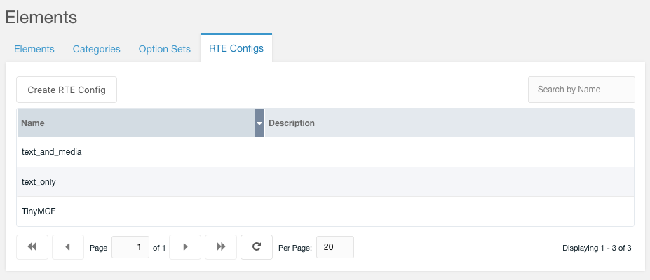

# Rich Text Editor (RTE) Configs

Under the RTE Configs tab you can manage all configuration sets for any installed RTEs.
 

RTE configs must have a unique name, which is used in [data-fred-rte-config](../elements/attributes.md#data-fred-rte-config) attribute to determin which RTE to use, if any.

Make sure RTE configs are valid JSON; you can use [JSON Lint](https://jsonlint.com/) as an external service or the [ACE editor](https://modx.com/extras/package/ace) MODX Extra which shows invalid JSON in the line-number columns as a white X in a red box.

## Default Configs

If you create a config with a same name as your RTE, for example `TinyMCE`, this config will be used as a default one, overriding its defaults. To learn more about creating RTE configurations, and to see sample configurations for the TinyMCE for Fred Extra, see the [RTE examples](../rte_configs/index.md) documentation.

### Overriding Default Configs

Fred option sets can specify the RTE configuration to use for each Element. In addition, a [data-fred-rte-config](../elements/attributes.md#data-fred-rte-config) attribute on an HTML Element with a `data-fred-name` attribue (as long as contenteditable is not set to false) will override both the Default and option set specific settings.
